# ○×ゲームとは

## 遊び方

○を扱うプレイヤーと×を扱うプレイヤーに分かれて遊ぶゲーム。  
盤面に○と×を交互に設置していき縦、横、斜めのいずれかの列に○か×を揃えた方のプレイヤーを勝者とする。
揃わずに盤面が○×で埋まった場合は引き分けとなる。

## 画面イメージ

| 番号 |      名称      |                    説明                    |
| ---- | -------------- | ------------------------------------------ |
| 1    | マス目         | 盤面を構成するマス目                       |
| 2    | 盤面           | マスを3×3で配置した土台                    |
| 3    | 記号           | マスに設置する○×                           |

## ルール

- ○側を先行とする。
- 同プレイヤーが2回連続で記号を設置することは出来ない。
- ○側プレイヤーは×記号を設置できない。逆も同様。
- 以下の条件のいずれかを満たすとゲーム終了とする。
  - 記号を揃えて勝者が決まる。
  - 全マスに○×を設置する。

[top page](./topPage.md)
