# マス目

## 機能

○側、×側プレイヤーの設置した記号を表示する

## 見た目

- 黒枠線の正方形で緑色に塗りつぶす。
- サイズ指定は無いが全マス目のサイズを統一する。
- 記号は視認出来ればサイズ、色に条件は無し。

## 文言

|       文言       |                       表示条件                        |
| ---------------- | ----------------------------------------------------- |
| (何も表示しない) | 初期状態                                              |
| ○                | ○側プレイヤーが何も表示していないマス目をクリックする |
| ×                | ×側プレイヤーが何も表示していないマス目をクリックする |

## 動作

|      動作      |                     条件、タイミング                      |
| -------------- | --------------------------------------------------------- |
| 何も表示しない | ゲーム開始時                                              |
| ○を設置する    | ○側プレイヤーが何も表示していないマス目をクリックしたとき |
| ×を設置する    | ×側プレイヤーが何も表示していないマス目をクリックしたとき |

[top page](./topPage.md)
