# 外部設計

## ゲームの流れ

1. ○×ゲームのページを開く
2. 盤面に何も置かれていない状態を表示する
3. ○が先行で進める
4. ○か×のどちらかが縦、横、斜めのいずれかで1列揃えるか9マス埋まったら終了
5. 勝者、引き分けを表示する
6. もう一度ボタンを押下したら2へ戻る。

フローチャート

## 画面仕様

イメージ図

| 番号 |        名称        |                  説明                  |
| ---- | ------------------ | -------------------------------------- |
| 1    | [マス目](./cell.md)             | 盤面を構成するマス目                   |
| 2    | [盤面](./board.md)               | マスを3×3で配置した土台                |
| 3    | 記号               | マスに設置する○×                       |
| 4    | [インフォメーション](./information.md) | ゲームの状況を表示するラベル           |
| 5    | [もう一度ボタン](./continueButton.md)     | ゲーム終了時に押下するともう一度遊べる |

> インフォメーション、もう一度ボタンの正確な位置指定は無し。
> イメージ図のように盤面の下に並んでいればOK。

## 有効ライン

全8ライン
- 横ライン1
- 横ライン2
- 横ライン3
- 縦ライン1
- 縦ライン2
- 縦ライン3
- 斜めライン1
- 斜めライン2

## ユーザーの可能な行動

|          行動          |                   結果                   |
| ---------------------- | ---------------------------------------- |
| [マス目を左クリックする](./feature_clickCell.md) | 何も設置されていなければ○×を設置する   |
| [もう一度ボタンを押す](./feature_submitContinueButton.md)   | 盤面を初期化して初めから遊べるようにする |

[top page](./topPage.md)
